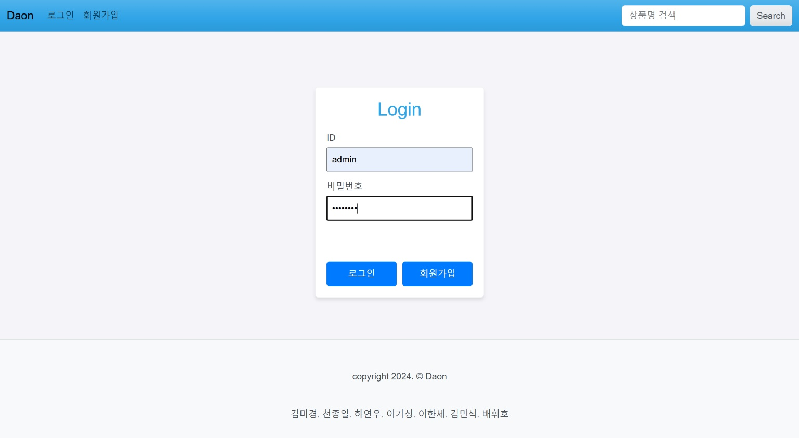
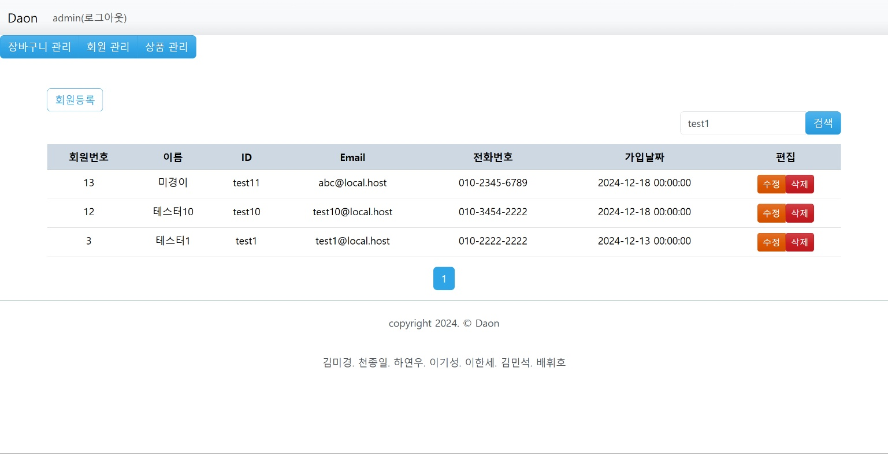
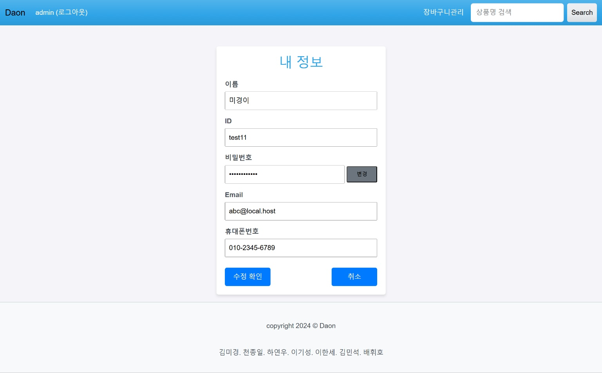
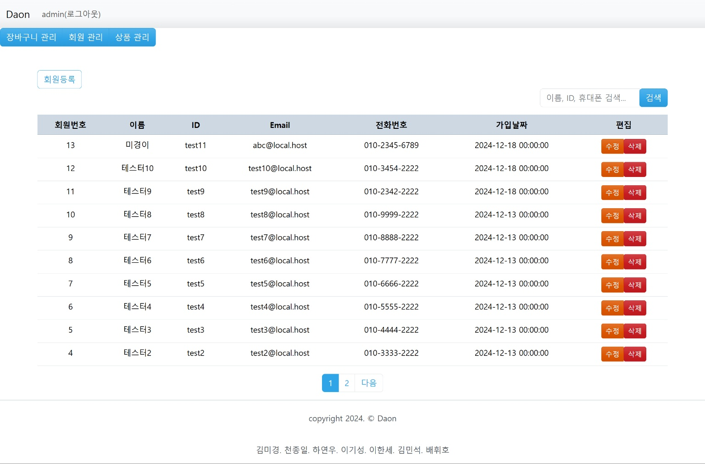

# Daon - 데이터 분석 도서 서비스

---

## 📑 목차

1. [프로젝트 소개](#프로젝트-소개)
2. [프로젝트 개발 일정](#프로젝트-개발-일정)
3. [담당 업무](#담당-업무)
4. [Skill & Tools](#skill--tools)
5. [기능 구현](#기능-구현)
6. [ER Diagram](#er-diagram)
7. [Use Case Diagram](#use-case-diagram)

---

## 프로젝트 소개
**Daon**은 머신 러닝, Python 등 데이터 분석에 특화된 전문 도서를  
쉽고 빠르게 검색하고, 장바구니에 담아볼 수 있는 웹 기반 도서 서비스입니다.

---

## 프로젝트 개발 일정

| 단계 | 기간 | 주요 작업 |
|------|------|-----------|
| 기획 설계 | 12.05 ~ 12.06 | ERD, Use case 정의, 구조 설계 |
| 기능 구현 | 12.09 ~ 12.16 | 회원, 상품, 장바구니 기능 개발 |
| 통합 및 테스트 | 12.16 ~ 12.19 | 전체 통합 및 검토 |
| 발표, 시연 | 12.20 | 최종 발표 및 데모 |

---

## 담당 업무

| 이름 | 담당 기능 | 주요 역할 |
|------|-----------|-----------|
| 김미경 | 팀장 / 회원 관리 | 회원 리스트, 수정/삭제, 통합, 배포, 데이터 및 세션 관리 |
| 천종일 | 회원 | 회원가입, 로그인, 정보수정/탈퇴, 검색, 통합, 세션 관리|
| 하연우 | 상품 | 상품 목록 및 상세 페이지, 통합, 데이터 관리 |
| 이기성 | 상품관리 | 상품 리스트, 수정/삭제, 통합, 배포 |
| 이한세 | 장바구니 | 장바구니 담기 및 리스트, 수량 수정, 통합 |
| 배휘호 | 장바구니 | 장바구니 페이징 및 리스트, 배포 |
| 김민석 | 장바구니 관리 | 장바구니 리스트, 수량 수정, 삭제, 검색, 통합 |

---

## Skill & Tools

### ▪ Language

  

### ▪ Backend

  
  
  

### ▪ Frontend

  
  
  
  

### ▪ Dev Tools

  
  
  
  

---

## 기능 구현

- **회원 관리 기능 담당**
  - 회원 리스트 조회
  - 회원 정보 수정
  - 회원 삭제

### 관리자 로그인 페이지

### 관리자 회원관리 페이지

### 회원 정보 수정 페이지

### 회원 리스트 페이지 (페이지네이션 포함)

---

## ER Diagram

  

- **user**: 사용자 정보 (id, username, password, email 등)
- **products**: 도서 정보 (id, 이름, 가격, 설명, 이미지)
- **cart**: 장바구니 정보 (user 연결, 제품 연결, 수량, 가격)

---

## Use Case Diagram

  

- 비회원은 회원가입, 상품 목록 조회, 검색, 상세 확인이 가능
- 회원은 로그인 후 장바구니 담기, 수량 수정 기능 제공
- 관리자는 상품, 회원, 장바구니 전체를 통합 관리

